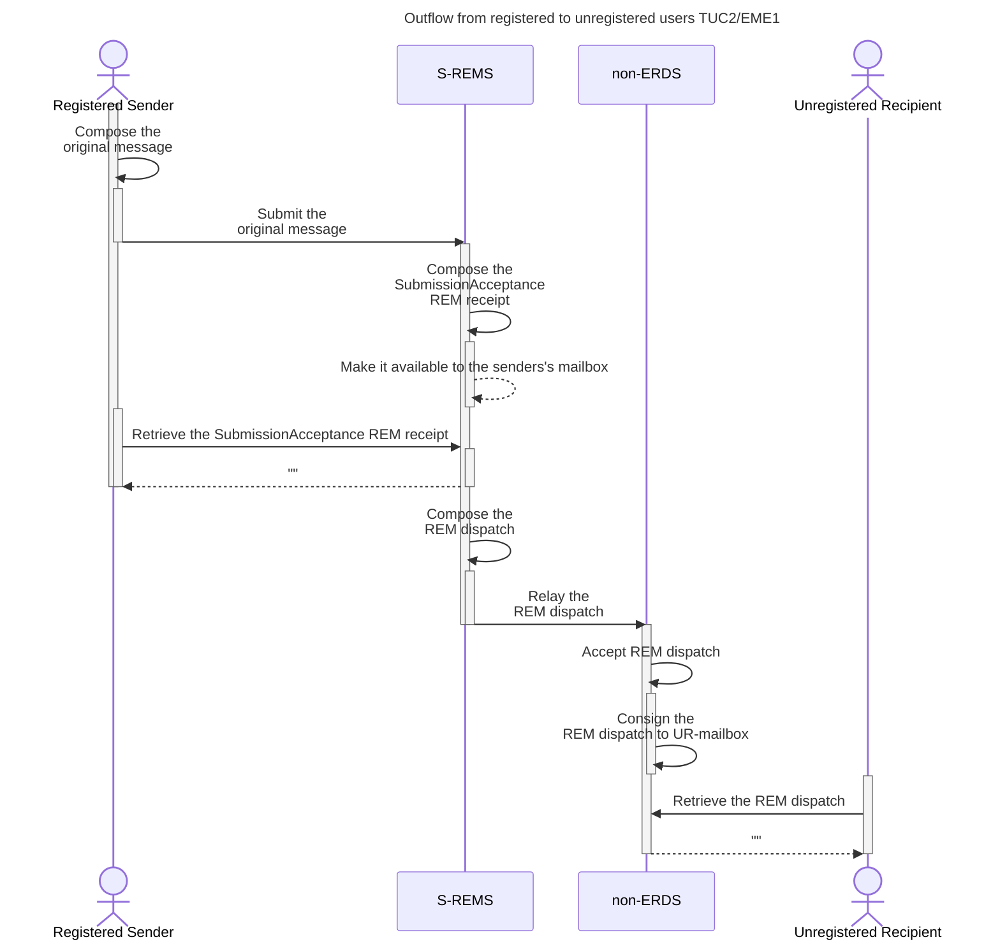
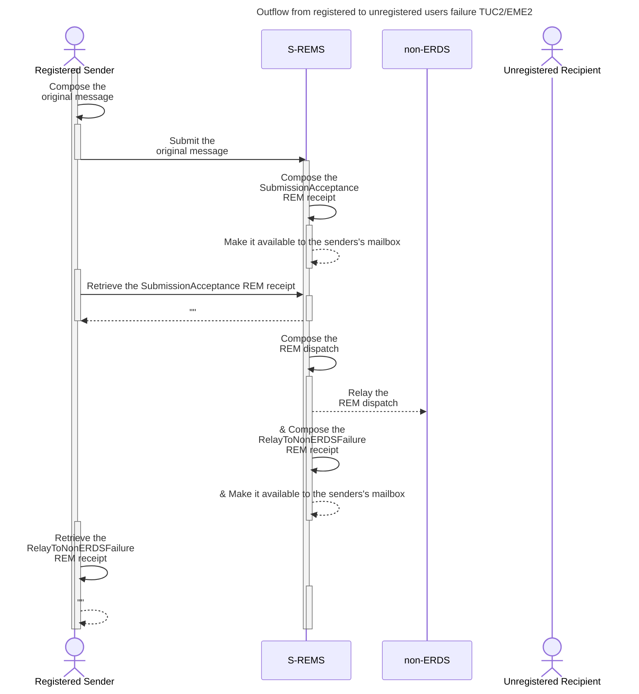
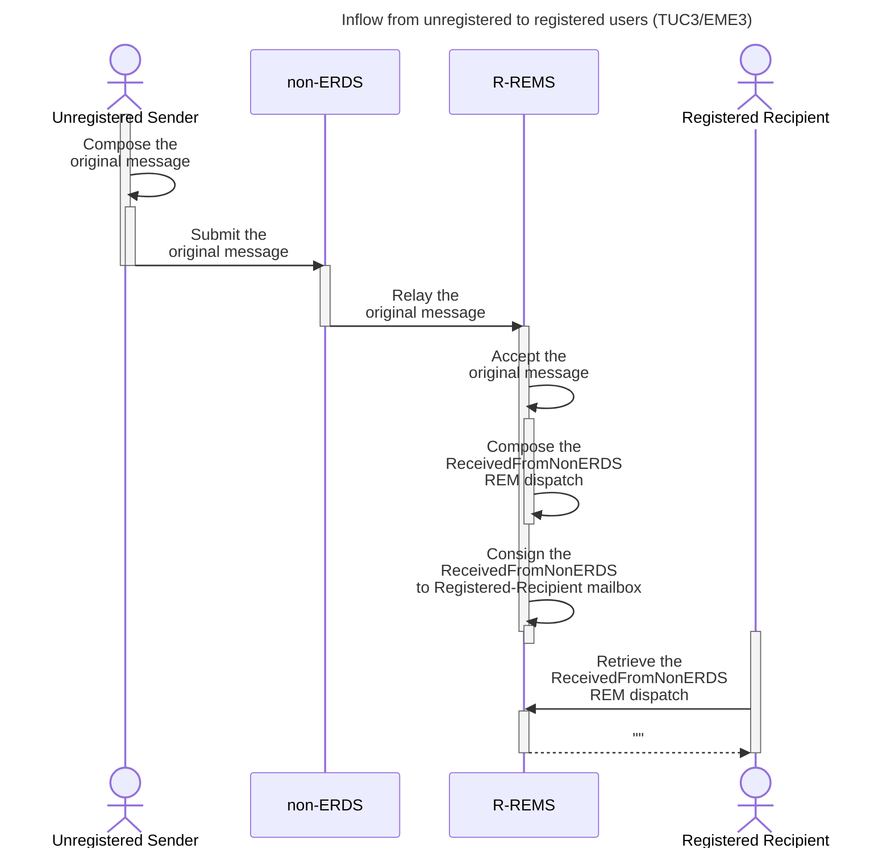

# Flussi

I diagrammi
TUC2/EME1, TUC2/EME2, TUC3/EME3
descrivono la parte più
generale dei flussi, mentre le particolarità (es.
i sotto flussi opzionali e/o gli errori gestiti)
sono riportati in Figure 9, Figure 10, Figure
11, Figure 12, Figure 13 e Figure 14.

## Registered to unregisterd users

## Outflow from registered to unregistered users failure TUC2/EME2

## : Inflow from unregistered to registered users (TUC3/EME3)

