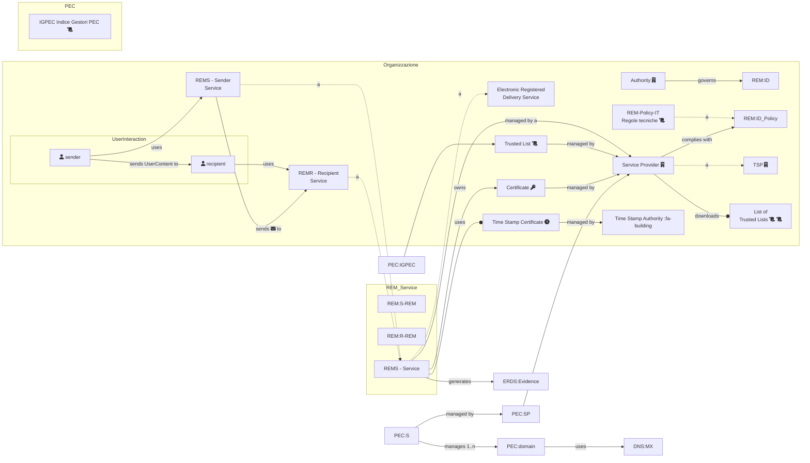
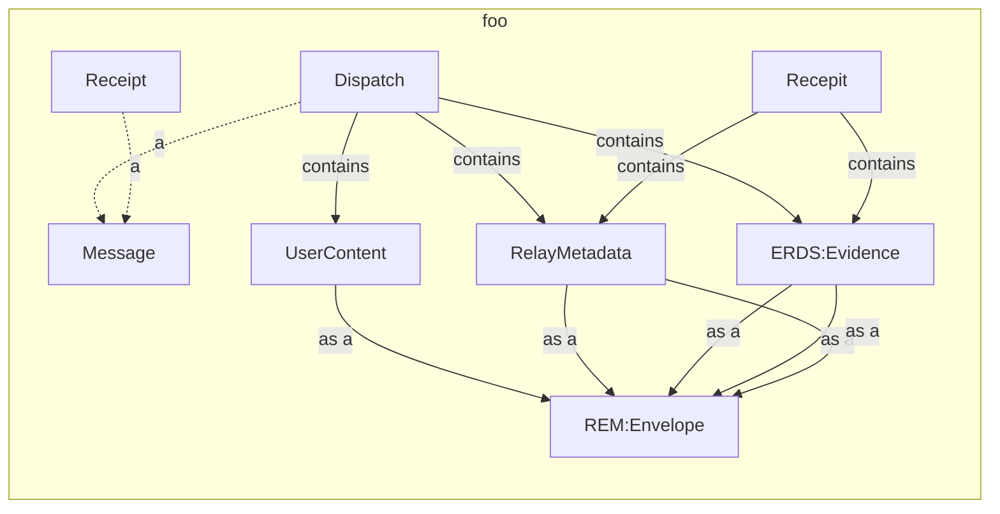

# REM

**NON UFFICIALE**

Diagrammi di esempio delle relazioni tra le entità definite nel glossario REM.

## Glossario

```mermaid
graph LR

subgraph UserInteraction
sender[fa:fa-user sender]
recipient[fa:fa-user recipient]
end

subgraph REM_Service
REM:S-REM
REM:R-REM
REM:S
end

subgraph Organizzazione
REM:ID
REM:ID_Authority[Authority fa:fa-building] -->|governs| REM:ID
REM:Policy_IT[REM-Policy-IT\nRegole tecniche fa:fa-scroll] -.->|a| REM:ID_Policy
ERDS[Electronic Registered\nDelivery Service]
REM:S[REMS - Service]
REM:SP[Service Provider fa:fa-building]
REM:S-REMS[REMS - Sender\nService]
REM:R-REMS[REMR - Recipient\nService]
REM:TL[Trusted List fa:fa-scroll]
REM:C[Certificate fa:fa-key]
TSP[TSP fa:fa-building]
LOTL[List of\n Trusted Lists fa:fa-scroll fa:fa-scroll]
UserInteraction
TSA[Time Stamp Authority fa:fa-clockfa:fa-building]
TSC[Time Stamp Certificate fa:fa-clock]
end

sender -->|uses| REM:S-REMS
recipient -->|uses| REM:R-REMS

sender -->|sends UserContent to| recipient

REM:S -.->|a| ERDS
REM:S -->|generates| ERDS:Evidence
REM:SP -->|complies with| REM:ID_Policy

REM:S-REMS & REM:R-REMS -.-> |a| REM:S -->|managed by a| REM:SP

REM:S-REMS-->|sends fa:fa-envelope to| REM:R-REMS
REM:TL -->|managed by| REM:SP
REM:SP -.->|a| TSP
REM:SP --o|downloads| LOTL

REM:S --o|uses| TSC -->|managed by| TSA
REM:S -->|owns| REM:C -->|managed by| REM:SP


%% REM vs PEC
subgraph PEC
IGPEC[IGPEC Indice Gestori PEC fa:fa-scroll]
end

PEC:IGPEC--> REM:TL
PEC:SP   --> REM:SP

PEC:S -->|managed by| PEC:SP
PEC:S -->|manages 1..n| PEC:domain
PEC:domain -->|uses| DNS:MX
```

## Imbustamenti

```mermaid
graph LR

subgraph foo
Dispatch & Receipt -.->|a| Message

Dispatch -->|contains| UserContent & RelayMetadata & ERDS:Evidence -->|as a| REM:Envelope

Recepit -->|contains| ERDS:Evidence & RelayMetadata -->|as a|REM:Envelope

end
```
