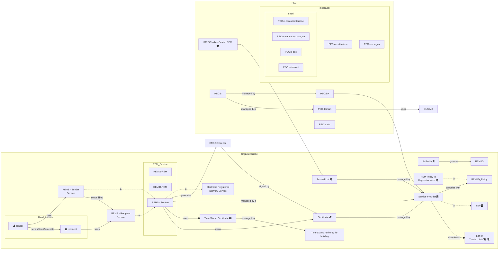
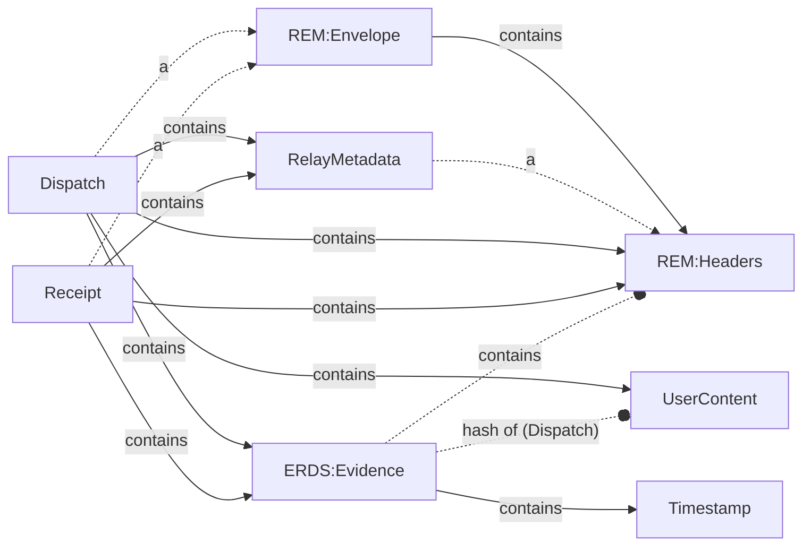
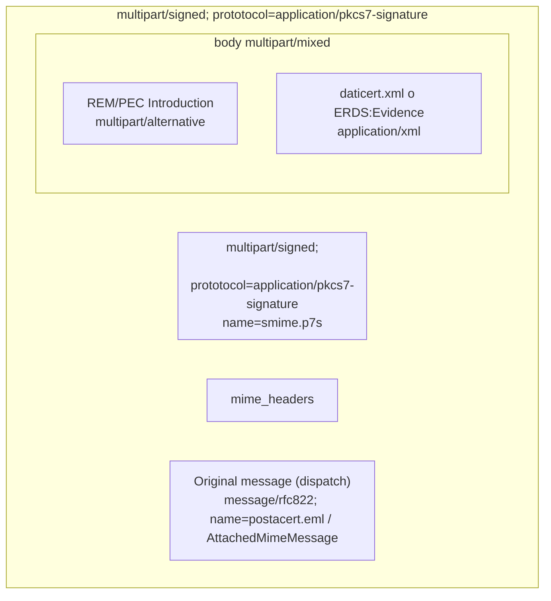

# REM

**NON UFFICIALE**

Diagrammi di esempio delle relazioni tra le entità definite nel glossario REM.

## Glossario

## Imbustamenti

Tabella 1 – Corrispondenza tra tipi messaggi PEC vs REM

|PEC|REM|
|---|---|
|Busta di Trasporto |REM dispatch
|Ricevuta di Accettazione |SubmissionAcceptance|
Ricevuta di Avvenuta Consegna| ContentConsignment|
|Avviso di non accettazione|SubmissionRejection|
|Avviso di mancata consegna (errore-consegna)|ContentConsignmentFailure / RelayFailure|
|Busta di anomalia (messaggio di posta ordinaria)|ReceivedFromNonERDS|
|Avviso mancata consegna (superamento tempi massimi previsti, 12h,24h)|ContentConsignmentFailure / RelayFailure(prevista solo per il tempolimite delle 24h)|

Q: Le REM:Receipt sono tutte e sole quelle associate alle ricevute?

## Daticert vs ERDS Evidence

La struttura dei messaggi REM e PEC è simile:

1. il media type è `multipart/signed; protocol="application/pkcs7-signature"` che contiene:

    a. un `multipart/mixed`

    b. una pcks7-signature (smime.p7s)

2. il multipart/mixed 1.a. contiene:

    a. un preambolo (REM introduction / PEC introduction)

    b. un XML con dei dati certificati (daticert.xml o ERDS:Evidence)

A differenza della PEC:

1. il daticert.xml non è firmato, ma si basa sulla firma del messaggio completo. Invece l'ERFS:Evidence è firmata.
2. la REM supporta una ulteriore sezione chiamata REM:Extension con media type `xml` o `octect-stream`. Questa sezione viene utilizzata dal profilo italiano `rem-policy-it` per inserire ulteriori informazioni non supportate dal profilo REM base.
